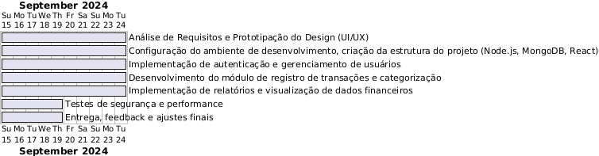

# Escopo do Projeto: Sistema Organizador Financeiro para Hamon Corp

## 1. Objetivo Geral
Desenvolver um sistema organizador financeiro para Hamon Corp, permitindo que colaboradores gerenciem de forma segura e eficiente seus ganhos e despesas. O sistema permitirá controle financeiro personalizado, oferecendo funcionalidades como registro de transações, categorização de despesas e receitas, além de relatórios detalhados para apoio na tomada de decisões.

## 2.Objetivos SMART

## 1. Específico (Specific):
Desenvolver um sistema que permita aos colaboradores da Hamon Corp registrar, categorizar e visualizar suas transações financeiras, garantindo que cada usuário tenha acesso apenas aos seus próprios dados por meio de login individual.
## 2. Mensurável (Measurable):
O sistema deverá ser capaz de registrar até 100 transações diárias por usuário, com relatórios mensais e anuais que apresentem, no mínimo, 90% de precisão na categorização de receitas e despesas.
## 3. Atingível (Achievable):
Utilizando tecnologias como Node.js, React e MongoDB, o sistema será desenvolvido em um prazo de 12 semanas, com entrega de um MVP (Produto Mínimo Viável) ao final da 8ª semana, permitindo ajustes e melhorias nas semanas subsequentes.
## 4. Relevante (Relevant):
Este sistema é fundamental para Hamon Corp, pois otimizará o gerenciamento financeiro dos colaboradores, melhorando a precisão no controle de gastos e receitas, além de facilitar a tomada de decisões financeiras estratégicas.
## 5. Temporal (Time-bound):
O sistema completo será desenvolvido e entregue em 12 semanas, com as funcionalidades principais (login, registro de transações e categorização) disponíveis no final da 8ª semana, e o módulo de relatórios finalizado até a 10ª semana.

## 3. Cronograma (Proposta)

Semana 1-2: Análise de Requisitos e Prototipação do Design (UI/UX)
Semana 3-4: Configuração do ambiente de desenvolvimento, criação da estrutura do projeto (Node.js, MongoDB, React).
Semana 5-6: Implementação de autenticação e gerenciamento de usuários.
Semana 7-8: Desenvolvimento do módulo de registro de transações e categorização.
Semana 9-10: Implementação de relatórios e visualização de dados financeiros.
Semana 11: Testes de segurança e performance.
Semana 12: Entrega, feedback e ajustes finais. gerar um código para usar no plantText

## Diagrama de Gantt

