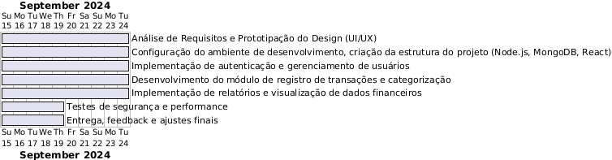
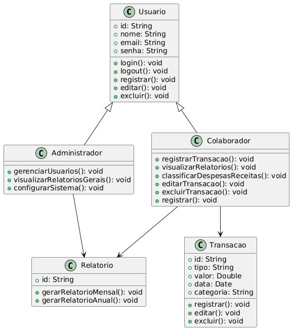
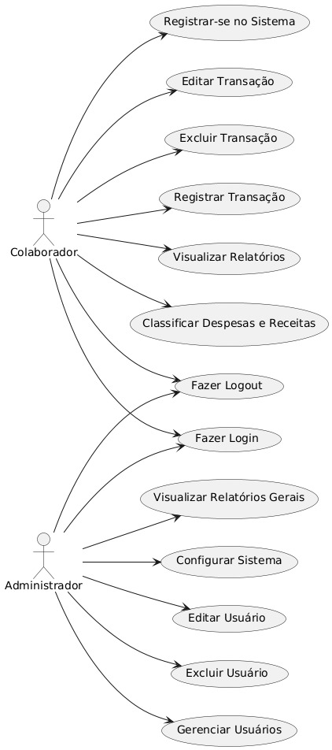
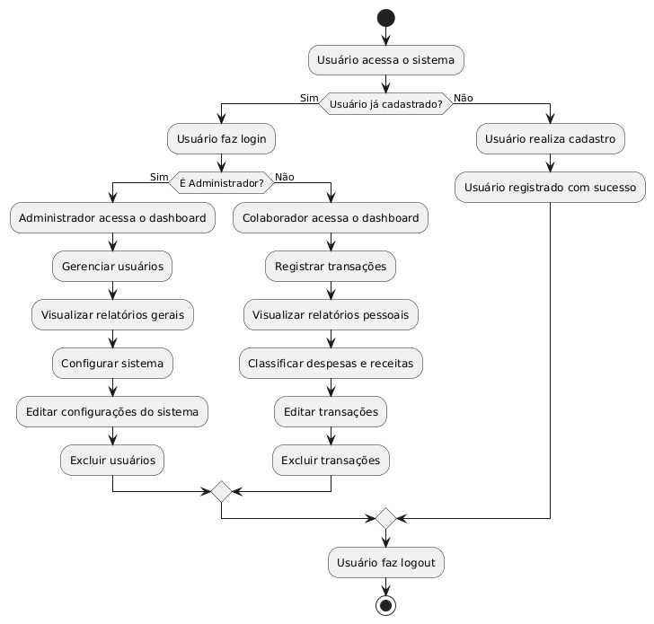

# Escopo do Projeto: Sistema Organizador Financeiro para Hamon Corp

## 1. Objetivo Geral
Desenvolver um sistema organizador financeiro para Hamon Corp, permitindo que colaboradores gerenciem de forma segura e eficiente seus ganhos e despesas. O sistema permitirá controle financeiro personalizado, oferecendo funcionalidades como registro de transações, categorização de despesas e receitas, além de relatórios detalhados para apoio na tomada de decisões.

## 2. Objetivos Específicos
- Implementar login individual para garantir que cada usuário tenha acesso apenas aos seus próprios dados financeiros.
- Fornecer uma interface para registro de transações de ganhos e despesas.
- Permitir a categorização de transações (ex.: alimentação, transporte, salário).
- Gerar relatórios detalhados para acompanhamento financeiro por período, categoria e total de transações.
- Oferecer uma visualização gráfica das despesas e receitas ao longo do tempo.
- Assegurar a segurança dos dados financeiros utilizando autenticação JWT e criptografia de senhas.

## Requisitos Funcionais
- **Autenticação e Autorização**:
  - O sistema deve permitir o login e cadastro de usuários, garantindo que cada colaborador veja apenas suas transações.
  - Utilização de JWT para autenticação segura e persistente.
- **Gestão de Transações**:
  - Inserir, editar e excluir transações financeiras.
  - Classificação de transações como “Despesa” ou “Receita”.
  - Categorização de transações por categorias customizáveis.
- **Relatórios e Visualizações**:
  - Relatórios mensais e anuais com totais por categoria.
  - Gráficos de receitas e despesas ao longo do tempo.
  - Filtros para visualizar transações por período e categoria.
- **Notificações**
  - Alertas sobre datas de vencimento ou quando o saldo atinge um limite predefinido.

1. **Alertas sobre Datas de Vencimento**: O sistema deve enviar notificações quando uma data de vencimento se aproximar.
2. **Alertas de Saldo**: O sistema deve alertar quando o saldo atingir um limite predefinido.

## Requisitos Não Funcionais

### Segurança
- **Conexão Segura com o Banco de Dados**: Utilizar TLS/SSL para garantir uma conexão segura com o banco de dados.

### Escalabilidade
- **Estrutura Modular**: Desenvolver uma arquitetura modular que permita a adição de novas funcionalidades sem comprometer o desempenho existente.

### Performance
- **Tempo de Resposta**: Assegurar que o tempo de resposta seja inferior a 2 segundos para a maioria das transações.
- **Otimização de Consultas**: Implementar otimizações nas consultas ao MongoDB para melhorar o desempenho.

### Usabilidade
- **Interface Intuitiva**: Criar uma interface que seja fácil de navegar e intuitiva para o usuário final.
- **Layout Responsivo**: Garantir que o layout seja responsivo e acessível em diferentes dispositivos, incluindo desktop e mobile.

## 3.Objetivos SMART

## 1. Específico (Specific):
Desenvolver um sistema que permita aos colaboradores da Hamon Corp registrar, categorizar e visualizar suas transações financeiras, garantindo que cada usuário tenha acesso apenas aos seus próprios dados por meio de login individual.
## 2. Mensurável (Measurable):
O sistema deverá ser capaz de registrar até 100 transações diárias por usuário, com relatórios mensais e anuais que apresentem, no mínimo, 90% de precisão na categorização de receitas e despesas.
## 3. Atingível (Achievable):
Utilizando tecnologias como Node.js, React e MongoDB, o sistema será desenvolvido em um prazo de 12 semanas, com entrega de um MVP (Produto Mínimo Viável) ao final da 8ª semana, permitindo ajustes e melhorias nas semanas subsequentes.
## 4. Relevante (Relevant):
Este sistema é fundamental para Hamon Corp, pois otimizará o gerenciamento financeiro dos colaboradores, melhorando a precisão no controle de gastos e receitas, além de facilitar a tomada de decisões financeiras estratégicas.
## 5. Temporal (Time-bound):
O sistema completo será desenvolvido e entregue em 12 semanas, com as funcionalidades principais (login, registro de transações e categorização) disponíveis no final da 8ª semana, e o módulo de relatórios finalizado até a 10ª semana.

## 4. Cronograma 

Semana 1-2: Análise de Requisitos e Prototipação do Design (UI/UX)
Semana 3-4: Configuração do ambiente de desenvolvimento, criação da estrutura do projeto (Node.js, MongoDB, React).
Semana 5-6: Implementação de autenticação e gerenciamento de usuários.
Semana 7-8: Desenvolvimento do módulo de registro de transações e categorização.
Semana 9-10: Implementação de relatórios e visualização de dados financeiros.
Semana 11: Testes de segurança e performance.
Semana 12: Entrega, feedback e ajustes finais. gerar um código para usar no plantText

## Diagrama de Gantt

# 5. Análise de Riscos - Sistema Organizador Financeiro

- **1. Falha na Segurança dos Dados**: Acesso indevido a dados financeiros. **Probabilidade**: Alta. **Impacto**: Muito alto. **Mitigação**: Criptografia de senhas (bcrypt), autenticação JWT, conexões HTTPS.
- **2. Perda de Dados**: Perda de transações ou informações financeiras. **Probabilidade**: Moderada. **Impacto**: Alto. **Mitigação**: Backups automáticos e replicação no MongoDB.
- **3. Desempenho Degradado**: Lentidão com aumento de usuários/transações. **Probabilidade**: Moderada. **Impacto**: Moderado. **Mitigação**: Otimização de consultas e uso de caching (Redis).
- **4. Estouro de Prazo**: Atrasos no desenvolvimento. **Probabilidade**: Moderada. **Impacto**: Alto. **Mitigação**: Cronograma claro e entregas iterativas.

# 6. Recursos Necessários - Sistema Organizador Financeiro

## 1. Tecnológicos
- **Node.js**: Backend para gerenciamento de transações e autenticação.
- **React**: Frontend para interface de usuário responsiva e interativa.
- **MongoDB**: Banco de dados NoSQL para armazenamento de dados financeiros.
- **JWT (JSON Web Tokens)**: Autenticação segura para controle de acesso.
- **Heroku/AWS**: Hospedagem e infraestrutura escalável.
- **Git/GitHub**: Controle de versão e colaboração entre equipes.

## 2. Equipe
- **Desenvolvedor Full-Stack**: Para implementar e integrar o frontend (React) e backend (Node.js).
- **Especialista em Segurança**: Para garantir a criptografia, autenticação JWT e segurança dos dados.
- **Designer UI/UX**: Para desenvolver uma interface amigável e intuitiva.
- **Gerente de Projeto**: Para coordenar o cronograma e o progresso do projeto.
- **Tester/QA**: Para realizar testes de usabilidade, performance e segurança.

## 3. Ferramentas de Desenvolvimento
- **VSCode**: Ambiente de desenvolvimento integrado (IDE).
- **Postman**: Para testes de APIs.
- **Jira/Trello**: Gerenciamento de tarefas e acompanhamento do progresso.
- **Docker**: Virtualização de ambientes para consistência de desenvolvimento.

## 4. Recursos Humanos
- **Treinamento**: Capacitação dos colaboradores em relação ao uso do sistema.
- **Suporte Técnico**: Equipe para manter e atualizar o sistema pós-implantação.

## 5. Orçamento
- **Licenças e Infraestrutura**: Custos com serviços de hospedagem (Heroku/AWS), ferramentas de desenvolvimento e segurança (certificados SSL).
- **Desenvolvimento**: Custo da equipe técnica para o desenvolvimento do sistema.

## Diagramas:

# Diagrama de Classes:

# Diagrama de Casos de Uso:

# Diagrama de Fluxo:

